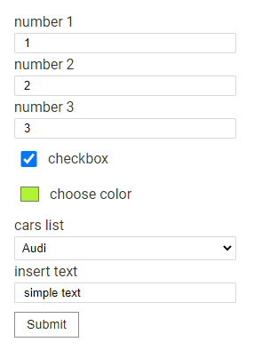
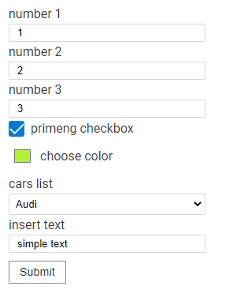
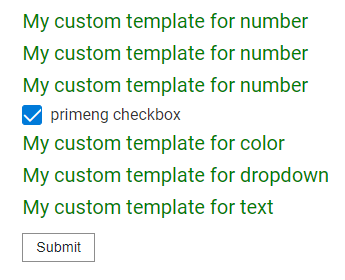

# DynamicForm

This library was generated with [Angular CLI](https://github.com/angular/angular-cli) version 9.1.13.

## API
`import { DynamicFormModule } from 'dynamic-form'`<br>
`selector: <dynamic-form>`

### @Inputs()
| Input          | Type         | Required                          | Description                             |
| ---------------| -------      | --------------------------        | ----------------------------------------|
| submitButton   | boolean      | Optional, default: true           | showing the submit button of the form   |
| formGroupList  | FormGroup    | Required                          | FormGroup on which the form is built    |
| styleClass     | string       | Optional, default: 'dynamic-form' | form container class                    |
| submitName     | string       | Optional, default: 'Submit'       | submit button name                      |
| debug          | boolean      | Optional, default: false          | showing the current value of the FormGroup                      |

### @Outputs()
| Output         | Type                                 | Required          | Description                             |
| ---------------| -------                              | ------------------| ----------------------------------------|
| onSubmitForm   | EventEmitter<FormGroup['value']>     | Optional          | form event when clicking on the Submit button   |
| onChangeForm   | EventEmitter\<IFormChangeEvent\>      | Optional          | form event when any parameter changes    |

### Available properties of the "question" variable
| Property          |   Type                        | Purpose                        |
| ---------------   | -------------------------     | --------------------------     |
| value             | `string or number or boolean` | value for the input field      |
| key               | `string or number`            | key for binding FormControlName. Must match the key in the FormGroup|
| label             | `string or number`            | label for the input field         |
| controlType       | `string`                      | the type of FormControl used      |
| required          | `boolean`                     | is the field required             |
| options           |   `any`                       | container for user settings       |   
| `_others_`        |   `any`                       | inherited from FormControl         |

|Method|Return type|
### The current list of FormControls
FormCheckBox

FormText

FormNumber

FormDropDown

FormColor

## Usage 
1) Register the `DynamicFormModule` in your app module. `import { DynamicFormModule } from 'es-dynamic-form'` 

 > `app.module.ts`
```typescript
import {BrowserModule} from '@angular/platform-browser';
import {NgModule} from '@angular/core';

import {AppComponent} from './app.component';
import {CommonModule} from '@angular/common';
import {FormsModule, ReactiveFormsModule} from '@angular/forms';
import {BrowserAnimationsModule} from '@angular/platform-browser/animations';
import {DynamicFormModule} from 'es-dynamic-form';

@NgModule({
    declarations: [
        AppComponent,        
    ],
    imports: [
        CommonModule,
        BrowserAnimationsModule,
        BrowserModule,
        ReactiveFormsModule,
        FormsModule,
        DynamicFormModule,
    ],
    entryComponents: [],
    bootstrap: [AppComponent]
})
export class AppModule {
}
```

2) Create your `FormGroup` in parent component
  > `app.component.ts`

``` typescript
import {DynamicFormBuilder, FormColor, FormDropDown, FormNumber, FormText, IFormChangeEvent} from 'es-dynamic-form';

export class AppComponent implements OnInit {
    private readonly cars = [
        {label: 'Audi', value: 'Audi'},
        {label: 'BMW', value: 'BMW'},
        {label: 'Fiat', value: 'Fiat'},
    ];
    public fg: FormGroup;

    constructor() {
    }

    ngOnInit() {
        this.fg = new FormGroup({
          checkbox: new FormText({value: true, key: 'checkbox', label: 'checkbox'}),
          text: new FormText({value: 'simple text', key: 'text', label: 'insert text'}),
          drop: new FormDropDown({
              value: this.cars[0].value, key: 'drop', label: 'cars list', options: {items: this.cars}
          }),
          arrayNumber: new FormArray([
              new FormNumber({value: 1, key: 0, label: 'number 1'}, Validators.min(0)),
              new FormNumber({value: 2, key: 1, label: 'number 2'}, Validators.min(0)),
              new FormNumber({value: 3, key: 2, label: 'number 3'}, Validators.min(0)),
          ]),
          color: new FormColor({value: '#fff222', key: 'color', label: 'choose color'}),
      });
    }
}
```

3) Add the created `FormGroup` to the 'dynamic-form' component
 > `app.component.html`
```angular2html
<dynamic-form [formGroupList]="fg" [submitButton]="true"></dynamic-form>
```
4) Done, the form will be automatically created on the page


## Use DynamicFormBuilder
by analogy with the native FormBuilder, there is a DynamicFormBuilder. It works the same way as the native Builder, except that it has a`"type"` parameter when creating a FormControl instance
```typescript
import {DynamicFormBuilder} from 'es-dynamic-form';
export class AppComponent {
public fb: DynamicFormBuilder = new DynamicFormBuilder();

    this.fg = this.fb.group({
        checkbox: [{value: true, key: 'checkbox', label: 'my checkbox'}, 'checkbox'],
        text: [{value: 'simple text', key: 'text', label: 'insert text'}, 'text'],
        drop: [{value: this.cars[0].value, key: 'drop', label: 'cars list', 
                options: {items: this.cars}}, 'dropdown'],
        arrayNumber: this.fb.array([
            [{value: 1, key: 0, label: 'number 1'}, 'number', Validators.min(0)],
            [{value: 2, key: 1, label: 'number 2'}, 'number', Validators.min(0)],
            [{value: 3, key: 2, label: 'number 3'}, 'number', Validators.min(0)],
        ]),
        color: [{value: '#fff222', key: 'color', label: 'colorpicker', disabled: false}, 'color'],
    });
}
```
**there is also an option to declare via FormBuilder.control()**
```typescript
        this.fg = this.fb.group({
            checkbox: this.fb.control({value: true, key: 'checkbox', label: 'my checkbox'}, 'checkbox'),
            text: this.fb.control({value: 'simple text', key: 'text', label: 'insert text'}, 'text'),
            drop: this.fb.control({
                value: this.cars[0].value, key: 'drop', label: 'cars list', options: {items: this.cars}
            }, 'dropdown'),
            arrayNumber: this.fb.array([
                this.fb.control({value: 1, key: 0, label: 'number 1'}, 'number', Validators.min(0)),
                this.fb.control({value: 2, key: 1, label: 'number 2'}, 'number', Validators.min(0)),
                this.fb.control({value: 3, key: 2, label: 'number 3'}, 'number', Validators.min(0)),
            ]),
            color: this.fb.control({value: '#fff222', key: 'color', label: 'colorpicker', disabled: false}, 'color'),
        })
```
## Using custom templates
Any component or template can be used. Adding a custom template is done via
the questTemplate directive. It accepts as input an array of pattern names to replace with the current one.
```angular2html
    <ng-template [questTemplate]="['checkbox']"></ng-template>
```

The context passed to <ng-template> has the following structure
```typescript
"context" : {
    $implicit: question <FormNumber | FormText | ... | FormDropDown>,
    fg: formGroup <FormGroup>
}
```
> question - FormControl for the current template
>
> fg - the FormGroup that the question belongs to

##### Let's say we want to use the p-checkbox from PrimeNG.  The replacement template will look like this
```angular2html
<dynamic-form
    [formGroupList]="fg"
    [submitButton]="true"
>
    <ng-template [questTemplate]="['checkbox']" let-question let-formgroup="fg">
        <div [formGroup]="formgroup">
            <p-checkbox
                    [binary]="true"
                    [formControlName]="question.key"
                    [label]="'primeng checkbox'"
            ></p-checkbox>
        </div>
    </ng-template>
</dynamic-form>
```

##### If you want to use 1 template for several FormControls, it is enough to specify the replaced template types in the questTemplate array separated by commas
```angular2html
    <ng-template [questTemplate]="['text', 'color', 'number', 'dropdown']" let-formcontrol>
        <span style="font-size: 20px; color: green">My custom template for {{formcontrol.controlType}}</span>
    </ng-template>
```

